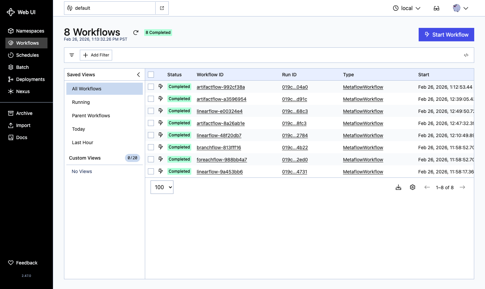
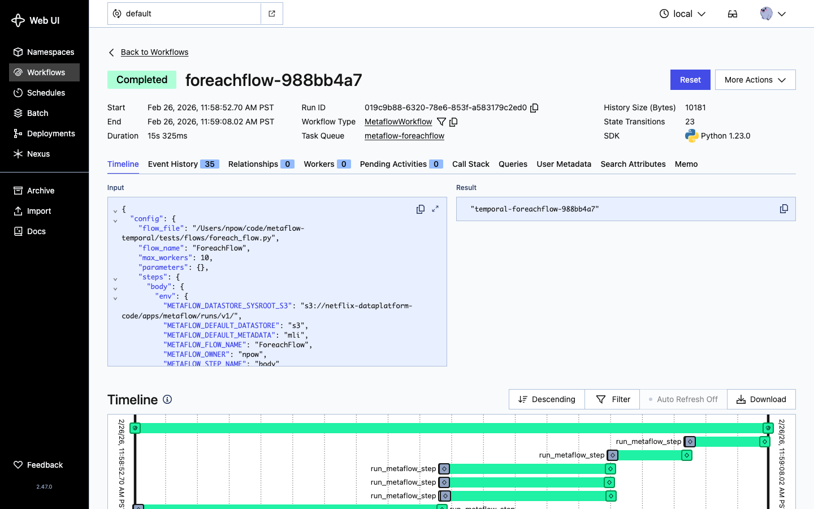
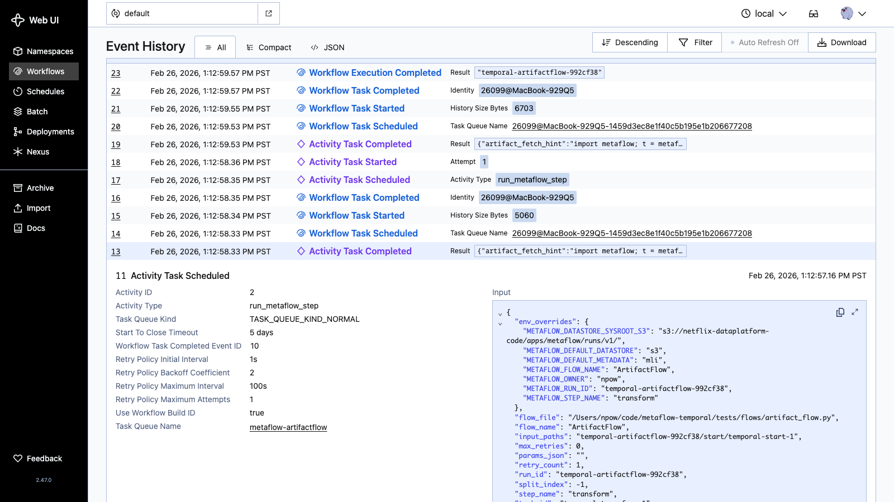

# metaflow-temporal

[](https://github.com/npow/metaflow-temporal/actions/workflows/ci.yml)
[](https://pypi.org/project/metaflow-temporal/)
[](LICENSE)
[](https://www.python.org/downloads/)

Run Metaflow flows as Temporal workflows.

`metaflow-temporal` generates a self-contained Temporal worker file from any Metaflow flow, letting
you schedule, deploy, and monitor your pipelines through Temporal while keeping all your existing
Metaflow code unchanged.

## Install

```bash
pip install metaflow-temporal
```

Or from source:

```bash
git clone https://github.com/npow/metaflow-temporal.git
cd metaflow-temporal
pip install -e ".[dev]"
```

## Quick start

```bash
python my_flow.py temporal create --output my_flow_worker.py
python my_flow_worker.py          # start the worker
python my_flow_worker.py trigger  # trigger a run
```

## Usage

### Generate and run a worker

```bash
python my_flow.py temporal create --output my_flow_worker.py
python my_flow_worker.py
```

### All graph shapes are supported

```python
# Linear
class SimpleFlow(FlowSpec):
    @step
    def start(self):
        self.value = 42
        self.next(self.end)
    @step
    def end(self): pass

# Split/join (branch)
class BranchFlow(FlowSpec):
    @step
    def start(self):
        self.next(self.branch_a, self.branch_b)
    ...

# Foreach fan-out
class ForeachFlow(FlowSpec):
    @step
    def start(self):
        self.items = ["alpha", "beta", "gamma"]
        self.next(self.process, foreach="items")
    ...
```

### Parametrised flows

Parameters defined with `metaflow.Parameter` are forwarded automatically:

```bash
python param_flow.py temporal create --output param_flow_worker.py
python param_flow_worker.py trigger greeting=world
```

## Configuration

### Metadata service and datastore

By default, `metaflow-temporal` uses whatever metadata and datastore backends are active in your
Metaflow environment. The generated worker file bakes in `metadata_type` and `datastore_type`
at creation time so every step subprocess uses the same backend.

To use a remote metadata service or object store, configure them before running `temporal create`:

```bash
# Remote metadata service + S3 datastore
python my_flow.py \
  --metadata=service \
  --datastore=s3 \
  temporal create my_flow_worker.py
```

Or via environment variables (applied to all flows):

```bash
export METAFLOW_DEFAULT_METADATA=service
export METAFLOW_DEFAULT_DATASTORE=s3
python my_flow.py temporal create my_flow_worker.py
```

### Compute backends and step decorators

Step decorators like `@kubernetes`, `@batch`, `@conda`, and third-party backends such as
`@sandbox`, `@daytona`, and `@e2b` are automatically forwarded to each step subprocess at
runtime. No extra configuration is needed — decorate your steps as usual:

```python
from metaflow import FlowSpec, step, kubernetes

class MyFlow(FlowSpec):
    @kubernetes(cpu=4, memory=8000)
    @step
    def train(self):
        ...
```

To inject a decorator at deploy time without modifying the flow source:

```bash
python my_flow.py --with=sandbox temporal create my_flow_worker.py
```

### Scheduling

Decorate your flow with `@schedule` and the worker automatically registers a Temporal Schedule
when it starts. The schedule fires the workflow on the specified cron:

```python
from metaflow import FlowSpec, schedule, step

@schedule(hourly=True)      # or daily=True, weekly=True, cron="0 6 * * ? *"
class DailyFlow(FlowSpec):
    @step
    def start(self):
        ...
```

```bash
python daily_flow.py temporal create daily_flow_worker.py
python daily_flow_worker.py  # registers the schedule and starts listening
```

### Run tags

Tags are attached to every run produced by the worker:

```bash
python my_flow.py temporal create --output my_flow_worker.py --tag team:ml --tag env:prod
```

### Project namespace isolation

Flows decorated with `@project` get full namespace isolation between branches. Different branches
use separate task queues and store runs under the project-aware name
(`<project>.<branch>.<FlowName>`), so user, staging, and production deployments never collide.

```python
from metaflow import FlowSpec, project, step

@project(name="myproject")
class TrainFlow(FlowSpec):
    ...
```

```bash
# User branch (default): myproject.user.alice.TrainFlow
python train_flow.py temporal create --output train_worker.py

# Named test branch: myproject.test.staging.TrainFlow
python train_flow.py temporal create --output train_worker.py --branch staging

# Production: myproject.prod.TrainFlow
python train_flow.py temporal create --output train_worker.py --production
```

Project tags (`project:myproject`, `project_branch:prod`) are automatically added to every run.

### Workflow execution timeout

Cap how long a single workflow execution may run before Temporal cancels it:

```bash
python my_flow.py temporal create --output my_flow_worker.py --workflow-timeout 7200
```

### Saga Pattern (Automatic Compensation)

Long-running flows that touch external systems (hotel bookings, cloud provisioning, payment
processing) need a way to undo completed work when a later step fails. The Saga pattern solves
this: each compensatable step declares a _compensation handler_ that runs automatically, in
reverse order (LIFO), if the workflow fails.

Import `compensate` from the extension and annotate compensation methods on your `FlowSpec`:

```python
from metaflow import FlowSpec, step
from metaflow_extensions.temporal.plugins.temporal import compensate

class BookingFlow(FlowSpec):

    @step
    def start(self):
        self.next(self.book_hotel)

    @step
    def book_hotel(self):
        self.hotel_id = reserve_hotel()   # side effect
        self.next(self.book_flight)

    @step
    def book_flight(self):
        self.flight_id = reserve_flight() # side effect
        self.next(self.confirm)

    @step
    def confirm(self):
        raise RuntimeError("Payment declined")  # triggers compensations

    @step
    def end(self):
        pass

    # Compensation handlers (NOT @step-decorated, no self.next())
    @compensate("book_hotel")
    def cancel_hotel(self):
        cancel_reservation(self.hotel_id)   # self.hotel_id injected from forward step

    @compensate("book_flight")
    def cancel_flight(self):
        cancel_reservation(self.flight_id)  # self.flight_id injected from forward step
```

When `confirm` raises, the workflow automatically runs `cancel_flight` then `cancel_hotel`
(reverse order), then re-raises the original error.

**Decorator API**

```python
@compensate("step_name")
def handler_method(self):
    ...
```

- `step_name`: the name of the `@step` method this compensation undoes.
- The handler receives the forward step's persisted artifacts as `self.<attr>`.
- The handler must **not** call `self.next()`.
- Compensation failures are logged but do not cascade (best-effort execution).

**Limitations (v1)**

- Compensations are tracked only for steps executed via the main linear path (`_execute_node`).
  Steps inside `foreach` bodies and parallel split branches are not compensated.

## How it works

`metaflow-temporal` compiles your flow's DAG into a self-contained worker file. Each Metaflow
step becomes a Temporal Activity (`@activity.defn`). A single `MetaflowWorkflow` (`@workflow.defn`)
interprets the CONFIG dict to orchestrate them.

The worker file:
- runs each step as a subprocess via the standard `metaflow step` CLI
- passes `--input-paths` correctly for joins and foreach splits
- records artifact names in each activity result with a ready-to-use retrieval snippet

### Temporal UI: workflow list

Multiple Metaflow flows show up as `MetaflowWorkflow` executions, each labelled by flow name:



### Temporal UI: run timeline

Foreach fan-outs and split/join branches appear as parallel Activity runs in the timeline:



### Temporal UI: artifact names

After each step completes, the activity result contains the artifact names and a one-liner to
fetch values from the Metaflow datastore:



```python
# Fetch any artifact value — copy the snippet from the Temporal UI
import metaflow
task = metaflow.Task("ArtifactFlow/temporal-abc123/transform/temporal-transform-0")
value = task.data.doubled
```

## Development

```bash
git clone https://github.com/npow/metaflow-temporal.git
cd metaflow-temporal
pip install -e ".[dev]"
pytest -v
```

For Tier 2 tests against a real Temporal server:

```bash
docker compose up -d
pytest -v -m integration
```

The Temporal UI is available at <http://localhost:8080>.

## License

[Apache 2.0](LICENSE)
